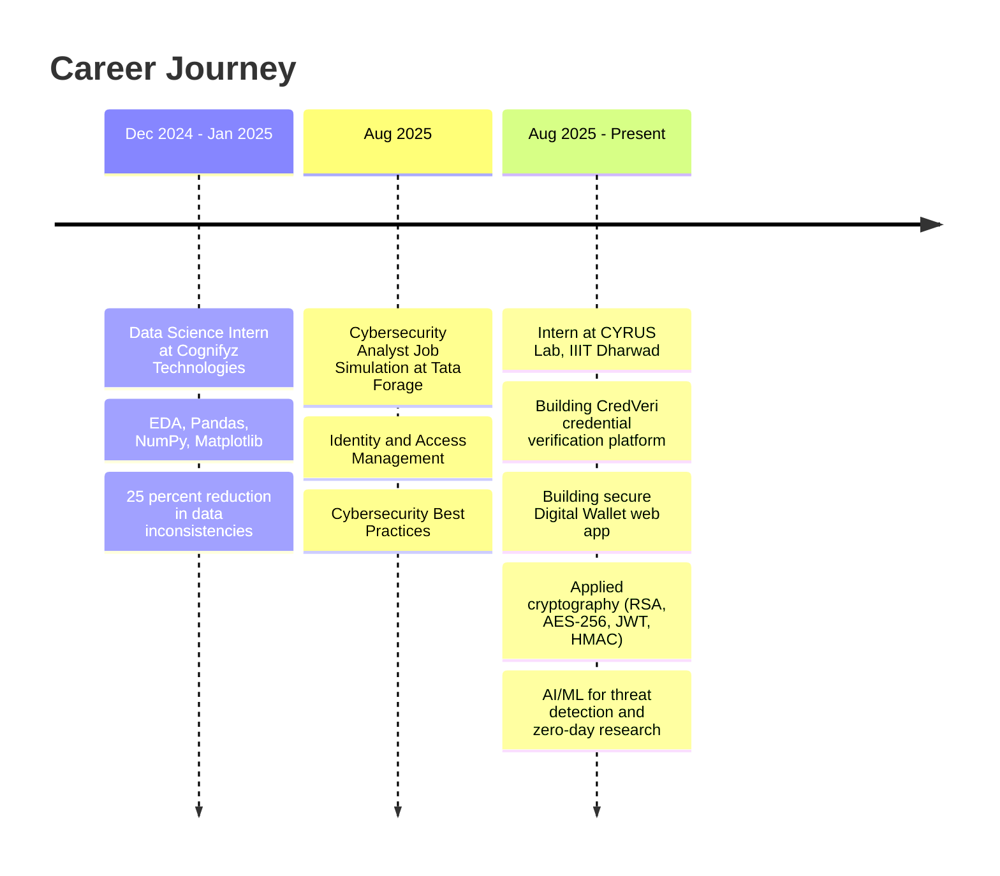

<!--
═══════════════════════════════════════════════════════════════════════════════
  ✦  SUDEEP DODDAMANI · GitHub Profile README  ✦
  ✦  AI × Cybersecurity × Cryptography                                          ✦
  ✦  Production build · Apr 2026 · SVG-safe                                     ✦
═══════════════════════════════════════════════════════════════════════════════
-->

<!-- ░▒▓ HEADER BANNER ▓▒░ -->
<div align="center">


<a href="https://github.com/DenverCoder1/readme-typing-svg">
  
</a>

<br/>

<a href="https://sudeep-ai-cybersecurity-portfolio.vercel.app/">
  
</a>
<a href="https://www.linkedin.com/in/sudeepdoddamani/">
  
</a>
<a href="https://twitter.com/doddamanisudeep">
  
</a>
<a href="mailto:sudeepdoddamani51@gmail.com">
  
</a>
<a href="https://github.com/SudeepRD001">
  
</a>

<br/><br/>


</div>

<br/>

<!-- ░▒▓ ABOUT ME ▓▒░ -->
## 👋 About Me


```yaml
name:        Sudeep Doddamani
role:        AI and Cybersecurity Engineer
location:    Karnataka, India
education:   BE in AI and Machine Learning
             Basaveshwar Engineering College, Bagalkot
             (CGPA: 7.61 | 2021-2024)
currently:
  - Intern @ CYRUS Lab, IIIT Dharwad
  - Researching AI/ML for advanced threat detection
  - Building CredVeri - a credential verification platform
  - Building a secure Digital Wallet web app
  - Phishing Detection System (~98% accuracy)
learning:
  - Applied Cryptography (AES-256, RSA, ECC, JWT, hashing)
  - LLM fine-tuning, RAG, and adversarial ML
  - Red Teaming, SIEM, Threat Hunting
ask_me_about:
  - AI/ML, Deep Learning, NLP, LLMs
  - Ethical Hacking, Threat Intelligence, SIEM
  - Cryptography, Secure Web Apps, Auth Systems
  - Python, Django, Flask, PyTorch, scikit-learn
fun_fact:    "I break systems to build safer ones."
```

<br/>

> **Forward-thinking AI and Cybersecurity specialist** with a BE in AI/ML and **CEHv12** certification.
> Skilled in **phishing detection (98% accuracy)**, threat intelligence, secure ML deployment, and applied cryptography.
> Passionate about **designing AI-driven security tools and cryptographically secure web platforms** that automate threat mitigation and fortify enterprise digital ecosystems.

<br/>

<!-- ░▒▓ TECHNICAL ARSENAL ▓▒░ -->
## ⚡ Technical Arsenal

<details open>
<summary><b>🤖 AI / ML / Deep Learning</b></summary>
<br/>
<p align="center">
  
  
  
  
  
  
  
  
  
  
  
  
</p>
</details>

<details open>
<summary><b>🛡️ Cybersecurity and Ethical Hacking</b></summary>
<br/>
<p align="center">
  
  
  
  
  
  
  
  
  
  
</p>
</details>

<details open>
<summary><b>🔐 Cryptography and Secure Engineering</b></summary>
<br/>
<p align="center">
  
  
  
  
  
  
  
  
  
  
  
  
</p>
</details>

<details open>
<summary><b>💻 Languages, Frameworks and Databases</b></summary>
<br/>
<p align="center">
  
  
  
  
  
  
  
  
  
  
  
  
  
  
  
</p>
</details>

<details open>
<summary><b>☁️ DevOps and Cloud</b></summary>
<br/>
<p align="center">
  
  
  
  
  
  
</p>
</details>

<br/>

<!-- ░▒▓ FEATURED PROJECTS ▓▒░ -->
## 🚀 Featured Projects

<table>
<tr>
<td width="50%" valign="top">

### 🪪 CredVeri — Credential Verification Platform
**Stack:** `Python` `Django` `PostgreSQL` `RSA` `SHA-256` `JWT` `QR + HMAC`

A secure credential issuance and verification platform that lets institutions issue tamper-proof digital credentials, and lets verifiers validate them in seconds.

**Cybersecurity and Cryptography:**
- 🔏 **RSA digital signatures** for issuer authenticity
- 🧬 **SHA-256 hashing** for credential integrity
- 🔐 **JWT-based** verifier sessions with short TTL
- 📷 **HMAC-signed QR codes** to prevent forgery
- 🛡️ Role-based access control (Issuer, Holder, Verifier)

`#Cryptography` `#Django` `#DigitalIdentity` `#Security`

</td>
<td width="50%" valign="top">

### 💳 Digital Wallet — Secure Web App
**Stack:** `Python` `Django/Flask` `PostgreSQL` `AES-256` `bcrypt` `JWT` `OAuth 2.0`

Cryptographically secure wallet web app for managing balance, transactions, and peer-to-peer transfers with bank-grade controls.

**Cybersecurity and Cryptography:**
- 🔐 **AES-256-GCM** for sensitive field encryption at rest
- 🧂 **bcrypt / Argon2** for password hashing
- 🪪 **JWT + refresh tokens** for authenticated APIs
- 🔁 **2FA (TOTP)** for transaction confirmation
- 🛑 Rate limiting, **CSRF**, **XSS** and **SQLi** protections
- 📝 Immutable audit logs (append-only ledger)

`#WebSecurity` `#Cryptography` `#Fintech` `#AppSec`

</td>
</tr>
<tr>
<td width="50%" valign="top">

### 🎣 Phishing Website Detection
**Stack:** `Python` `Scikit-learn` `Random Forest` `Logistic Regression`

High-accuracy ML system that classifies URLs as phishing or legitimate. Optimized via feature engineering and cross-validation, achieving **~98% detection accuracy**.

`#MachineLearning` `#Cybersecurity` `#PhishingDetection`

</td>
<td width="50%" valign="top">

### 🎨 Text-to-Image Generation
**Stack:** `PyTorch` `Stable Diffusion` `Hugging Face` `Diffusers`

Robust pipeline that synthesizes high-quality images from natural-language prompts using Stable Diffusion and Hugging Face Transformers.

`#DeepLearning` `#GenerativeAI` `#NLP`

</td>
</tr>
<tr>
<td width="50%" valign="top">

### 🗣️ Speech-to-Speech Indic Translator
**Stack:** `LLMs` `NLP` `Speech Recognition`

Real-time **Kannada to English** translation system powered by LLMs and NLP, achieving high BLEU and ROUGE scores.

`#LLM` `#NLP` `#IndicLanguages`

</td>
<td width="50%" valign="top">

### 📡 WiFi Penetration Testing Lab
**Stack:** `Kali Linux` `Aircrack-ng` `Bash`

Educational guide demonstrating WiFi security auditing using the Aircrack-ng suite, built to promote cybersecurity awareness and responsible disclosure.

`#EthicalHacking` `#WiFiSecurity` `#Pentesting`

</td>
</tr>
<tr>
<td width="50%" valign="top">

### ⌨️ Advanced Keylogger (Educational)
**Stack:** `Python` `Flask` `Cryptography`

Educational keylogger with screenshot capture, encrypted logs, email reporting, a local Flask GUI, and Windows persistence — for ethical research only.

`#Python` `#Security` `#Flask`

</td>
<td width="50%" valign="top">

### 🔐 Advanced Password Strength Checker
**Stack:** `Flask` `zxcvbn-python` `Web App`

Secure web application that analyzes password strength using entropy, pattern recognition, and crack-time estimation.

`#WebApp` `#Security` `#Flask`

</td>
</tr>
<tr>
<td width="50%" valign="top">

### 📝 Text Summarizer (Transformers)
**Stack:** `Hugging Face` `BART` `Gradio`

Summarizes text from raw input, URLs, or PDF documents using `facebook/bart-large-cnn` with a clean Gradio UI.

`#NLP` `#LLM` `#HuggingFace`

</td>
<td width="50%" valign="top">

### 🧪 AI-Powered Threat Intelligence (Ongoing @ CYRUS)
**Stack:** `Python` `ML` `Anomaly Detection`

Researching novel algorithms for **zero-day vulnerability** identification and persistent threat detection at IIIT Dharwad's Cybersecurity Research Group.

`#Research` `#ThreatIntelligence` `#AnomalyDetection`

</td>
</tr>
</table>

<br/>

<!-- ░▒▓ EXPERIENCE TIMELINE ▓▒░ -->
## 💼 Experience Timeline



<br/>

<!-- ░▒▓ CERTIFICATIONS ▓▒░ -->
## 🏆 Certifications

<p align="center">
  
  
  
  
</p>

<br/>

<!-- ░▒▓ GITHUB STATS ▓▒░ -->
## 📊 GitHub Analytics

<div align="center">


<br/>


</div>

<br/>

<!-- ░▒▓ TROPHIES ▓▒░ -->
## 🏅 GitHub Trophies

<div align="center">
  
</div>

<br/>

<!-- ░▒▓ ACTIVITY GRAPH ▓▒░ -->
## 📈 Contribution Graph

<div align="center">
  
</div>

<br/>

<!-- ░▒▓ SNAKE ANIMATION ▓▒░ -->
## 🐍 Contribution Snake

<div align="center">
  
</div>

<sub>Snake regenerates every 12 hours via GitHub Actions (workflow setup in <code>SETUP_GUIDE.md</code>).</sub>

<br/>

<!-- ░▒▓ DEV QUOTE ▓▒░ -->
## 💭 Quote of the Day

<div align="center">
  
</div>

<br/>

<!-- ░▒▓ CONNECT ▓▒░ -->
## 🌐 Let's Connect

<div align="center">

> **Open to:** Research collaborations, AI-Security projects, Cryptography work, Internships, Open-source contributions
>
> 📫 **Reach me at:** [sudeepdoddamani51@gmail.com](mailto:sudeepdoddamani51@gmail.com)

<a href="https://sudeep-ai-cybersecurity-portfolio.vercel.app/"></a>
<a href="https://www.linkedin.com/in/sudeepdoddamani/"></a>
<a href="https://twitter.com/doddamanisudeep"></a>
<a href="mailto:sudeepdoddamani51@gmail.com"></a>
<a href="https://github.com/SudeepRD001"></a>

</div>

<br/>

<!-- ░▒▓ FOOTER ▓▒░ -->
<div align="center">
  
</div>

<p align="center">
  <i>From <a href="https://github.com/SudeepRD001">SudeepRD001</a> — "I break systems to build safer ones."</i>
</p>
